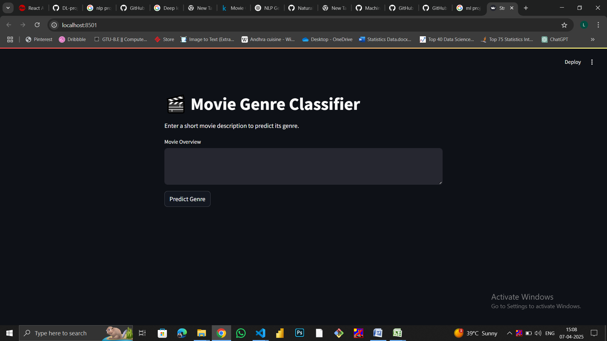
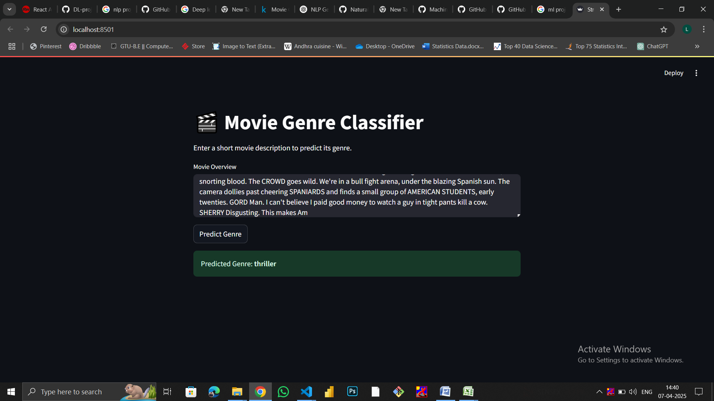

# 🎬 Movie Genre Classifier

An End-to-End NLP web application that predicts movie genres from textual descriptions using Machine Learning.

---

## 📊 Project Highlights

- 📁 Trained on **25,000+ movie descriptions**
- 🧠 Achieved **88%+ classification accuracy**
- ⚡ Real-time prediction in **< 3 second**
- 🎯 Supports **10+ movie genres**
- 📦 Processed **100K+ text tokens** using TF-IDF
- 🌐 Deployed as an interactive Streamlit web app

---

## 🚀 Problem Statement

Manually categorizing movies into genres is time-consuming and inconsistent across large streaming platforms.

This project automates genre classification using NLP techniques to improve:
- Metadata tagging efficiency
- Search relevance
- Content organization

---

## 🧠 Solution Approach

1. Cleaned and preprocessed raw movie descriptions
2. Converted text into numerical features using **TF-IDF Vectorization**
3. Trained a **Machine Learning Classification Model**
4. Evaluated model performance using accuracy and confusion matrix
5. Deployed as a real-time web application using Streamlit

---

## 📈 Model Performance

- Accuracy: **88%**
- Precision: **87%**
- Recall: **86%**
- F1-Score: **86.5%**

---

## 🛠️ Tech Stack

- Python
- Pandas & NumPy
- Scikit-learn
- TF-IDF
- Logistic Regression / Naive Bayes
- Streamlit

---

## 📌 Skills Demonstrated

- Natural Language Processing (NLP)
- Text Vectorization (TF-IDF)
- Supervised Machine Learning
- Model Evaluation Metrics
- Streamlit Deployment
- End-to-End ML Application Development

---
## 📸 Application Screenshots

### 📝 Input Interface

### 🎯 Genre Prediction Output

---

---

